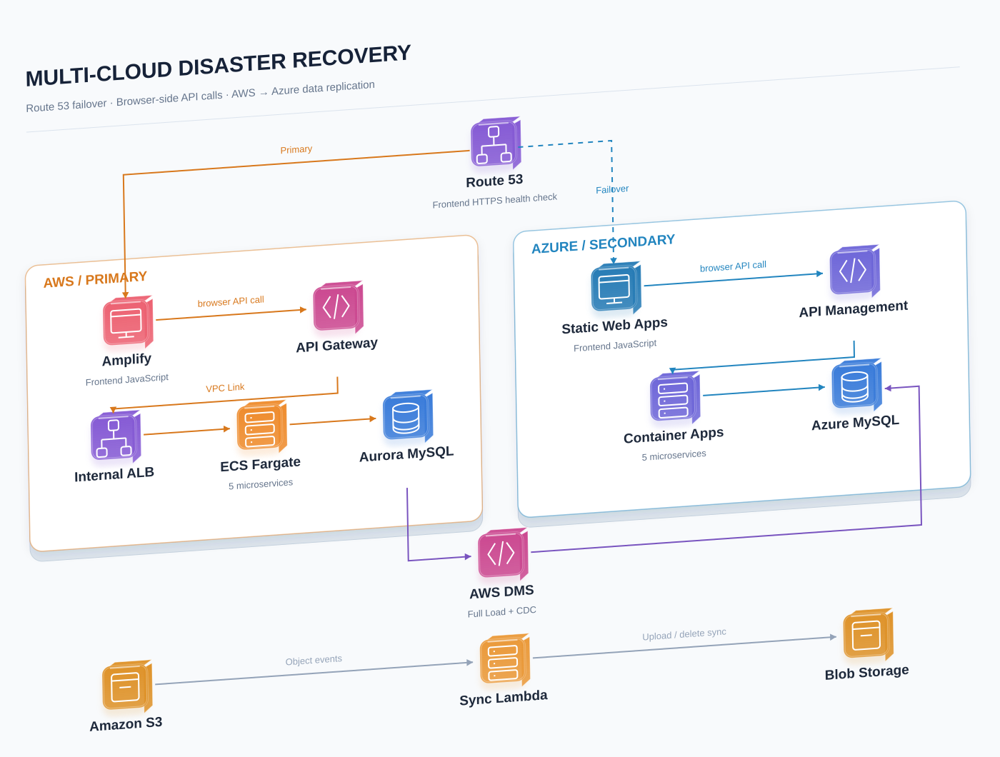
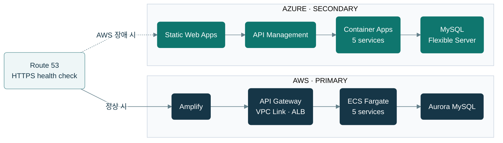
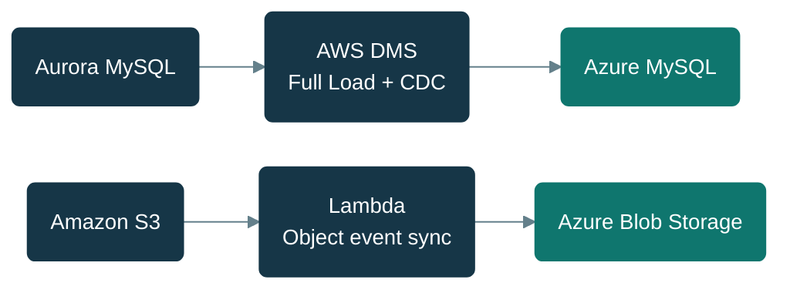
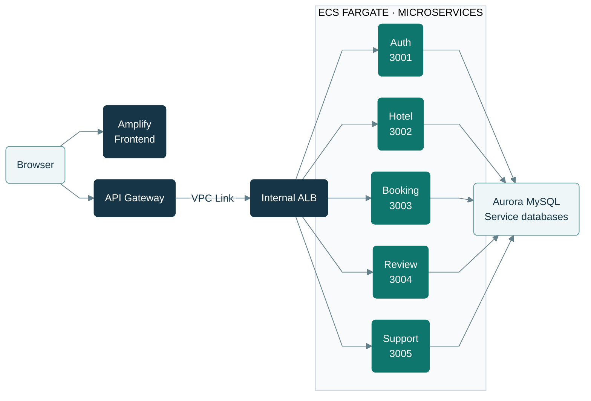

# AI 여행 예약 플랫폼 — Project TEAM AWS

야놀자 스타일의 여행 및 숙박 예약 플랫폼.  
모놀리식 백엔드를 **5개 마이크로서비스**로 분리한 구조입니다.

---

## 아키텍처



[draw.io 편집 파일](docs/diagrams/team-dr-isometric.drawio)

### 멀티클라우드 DR 구성

<details>
<summary>Mermaid 원본 보기</summary>



</details>

Route 53의 Primary/Secondary 프론트엔드 전환 구성과 각 클라우드의 API 경로를 요약했습니다. 헬스체크 대상은 AWS 프론트엔드이며, 백엔드 장애 전체를 감지하는 구성은 아닙니다.

<details>
<summary>Mermaid 원본 보기</summary>



</details>

데이터베이스는 DMS를 통해 AWS → Azure로 복제하고, 이미지·첨부파일은 S3 이벤트를 처리하는 Lambda가 Blob Storage로 동기화합니다. DMS 복제 리소스는 Azure MySQL 연결 변수 설정 시 생성됩니다. 위 구성도는 저장소 정의를 기준으로 하며 실제 배포 상태나 복구 시간 측정 결과를 나타내지는 않습니다.

### EC2 배포 구조 (로컬 테스트)

> 상세 배포 가이드는 `cloudformation/3tier-seoul.yml` 참고

```
[Browser]
    │
    ▼
[Frontend EC2 — nginx :80]  ── 정적 파일 (frontend/public)
    │
    ├── /api/auth/*          → auth-service EC2    :3001  (auth_db)
    ├── /api/reviews/*       → review-service EC2  :3004  (review_db)
    ├── /api/bookings/*      → booking-service EC2 :3003  (booking_db)
    └── /api/*               → hotel-service EC2   :3002  (hotel_db)

[ElasticMQ :9324]  ── SQS 로컬 대체 (hotel EC2에서 실행)
[MySQL EC2 :3306]  ── 4개 DB (auth_db / hotel_db / booking_db / review_db)
```

### AWS 서비스 구성

<details>
<summary>Mermaid 원본 보기</summary>



</details>

5개 서비스(auth · hotel · booking · review · support)는 각자의 데이터베이스를 사용합니다. API 진입점, ECS 서비스 및 Aurora 구성은 현재 Terraform 정의를 기준으로 정리했습니다.

### 서비스 간 통신

| 호출 방향 | 방법 | 용도 |
|-----------|------|------|
| booking-service → hotel-service | HTTP `x-internal-secret` | 예약 시 객실 정보 조회 |
| review-service → booking-service | HTTP `x-internal-secret` | 리뷰 작성 시 예약 확인 |
| review-service → SQS rating-queue | SQS Publish | 리뷰 생성/삭제 시 평점 갱신 요청 |
| hotel-service ← SQS rating-queue | SQS Consume | 메시지 수신 후 평점 집계 후 DB 업데이트 |
| booking-service → SQS booking-queue | SQS Publish | 예약 확정 시 이메일 알림 요청 |
| Lambda ← SQS booking-queue | SQS Trigger | 메시지 수신 후 AWS SES로 예약 확정 이메일 발송 |

> 로컬/EC2 환경에서는 SQS 대신 **ElasticMQ** 컨테이너로 대체 (`SQS_ENDPOINT=http://elasticmq:9324`)

---

## Terraform 배포 현황

> 인프라 코드는 `terraform/` 폴더 참고

| 리소스 | 상태 | 비고 |
|--------|------|------|
| VPC / 서브넷 / SG | ✅ 완료 | 퍼블릭 2개, 프라이빗 App 2개, 프라이빗 DB 2개 |
| NAT Instance | ✅ 완료 | ECS Fargate 인터넷 출구 (추후 VPC Endpoint 전환 예정) |
| MySQL EC2 | ✅ 완료 | DMS 마이그레이션 완료 후 제거 예정 |
| ECR | ✅ 완료 | auth / hotel / booking / review |
| ECS Fargate | ✅ 완료 | 서비스별 desired_count=2 |
| ALB (internal) | ✅ 완료 | VPC Link 연결용 |
| RDS MySQL | ✅ 완료 | db.t3.micro, 20GB |
| API Gateway | ✅ 완료 | HTTP API, CORS `*` |
| Amplify | ✅ 완료 | frontend/ 자동 배포 |
| Cognito | ⏳ 미완료 | 보안 작업 시 설정 예정 |
| WAF | ⏳ 미완료 | 보안 작업 시 설정 예정 |
| CodePipeline | ⏳ 미완료 | 배포 자동화 작업 시 설정 예정 |
| CloudWatch Dashboard | ⏳ 미완료 | 로그 작업 시 설정 예정 |
| DMS | ⏳ 미완료 | MySQL EC2 → RDS 마이그레이션 |

> `APP_MODE=local` 유지 중 — Secrets Manager 설정 완료 후 `aws`로 변경 필요 (`terraform/ecs.tf` 주석 참고)

---

## ECS Fargate vs EKS

| 항목 | ECS Fargate | EKS |
|---|---|---|
| 설정 난이도 | 낮음 | 높음 |
| 운영 오버헤드 | 낮음 | 높음 |
| AWS 네이티브 | ✅ | 부분적 |
| K8s 이식성 | ❌ | ✅ |
| 클러스터 비용 | 없음 | $0.10/시간 추가 |
| 배포 방식 | CodeDeploy | kubectl / Helm / ArgoCD |
| **권장 상황** | 빠른 배포, 운영 단순화 | K8s 경험, 멀티클라우드 고려 |

---

## AWS 서비스 구성

| 서비스 | 역할 |
|---|---|
| **Amplify** | 프론트엔드 정적 파일 호스팅 + GitHub 자동 배포 (`appRoot: frontend`) |
| **WAF** | SQL Injection, XSS 차단 / Rate Limiting (API Gateway에 연결) |
| **API Gateway** | HTTP API 엔드포인트 + Cognito JWT Authorizer + VPC Link |
| **ALB** | VPC 내부 트래픽 로드밸런싱 (internal, ECS Target Group 라우팅) |
| **ECS Fargate** | 4개 마이크로서비스 컨테이너 실행 |
| **ECR** | 서비스별 Docker 이미지 저장소 |
| **Cognito** | User Pool + JWT 토큰 발급 + Post Confirmation Lambda 트리거 |
| **RDS MySQL** | MySQL 8.0, 4개 DB (auth_db / hotel_db / booking_db / review_db) |
| **DynamoDB** | 호텔 검색 캐시 (`TravelBookingCache`) |
| **SQS** | `rating-queue` (평점 갱신), `booking-queue` (예약 이메일) |
| **SES** | 예약 확정 이메일 발송 (Sandbox → Production 신청 필요) |
| **S3** | 호텔 이미지 원본 / 썸네일 / 영상 / 로그 보관 |
| **Bedrock** | Claude 3 Haiku 모델 액세스 활성화 |
| **Secrets Manager** | 서비스별 시크릿 (`travel-app/auth-service` 등) |
| **CloudWatch** | 서비스별 로그 그룹, 알람, 대시보드 |
| **Athena** | S3 로그 SQL 분석 |
| **DMS** | MySQL EC2 → RDS 무중단 데이터 이전 |
| **CodePipeline v2** | 백엔드 CI/CD 자동화 (`backend/**` 경로 필터) |
| **CodeBuild** | Docker 이미지 빌드 + ECR push |

---

## Lambda 구성

| 함수 | 트리거 | 역할 | IAM 권한 |
|---|---|---|---|
| `booking-notification` | SQS `booking-queue` | 예약 확정 이메일 발송 | `ses:SendEmail`, `sqs:ReceiveMessage` |
| `image-resize` | S3 업로드 이벤트 | 호텔 이미지 썸네일 생성 | `s3:GetObject`, `s3:PutObject` |
| `cognito-post-confirm` | Cognito Post Confirmation | auth_db 유저 프로필 초기화 | `rds-data:ExecuteStatement` |

### 예약 이메일 흐름

```
booking-service
    → SQS (booking-queue) 메시지 발행
        → Lambda 트리거
            → SES 이메일 발송 → 사용자 이메일
```

---

## API Gateway 구성

### 라우팅 규칙

| 경로 | 대상 서비스 | Cognito 인증 |
|---|---|---|
| `ANY /auth/register` | auth-service | ❌ (공개) |
| `ANY /auth/login` | auth-service | ❌ (공개) |
| `ANY /auth/{proxy+}` | auth-service | ✅ |
| `ANY /hotels/{proxy+}` | hotel-service | ✅ (조회는 선택) |
| `ANY /bookings/{proxy+}` | booking-service | ✅ |
| `ANY /reviews/{proxy+}` | review-service | ✅ |

### 보안 구성

```
인터넷
  └── WAF (악성 요청 차단)
        └── API Gateway (HTTPS, Cognito JWT 검증)
              └── VPC Link
                    └── ALB internal (VPC Link에서만 인바운드)
                          └── ECS (ALB에서만 인바운드)
                                └── RDS (ECS에서만 3306 허용)
```

---

## CI/CD (모노레포 경로 필터)

| push 경로 | Amplify | CodePipeline |
|---|---|---|
| `frontend/**` | ✅ 빌드 | ❌ 스킵 |
| `backend/**` | ❌ 스킵 | ✅ 빌드 |
| `docs/**`, `*.md` | ❌ 스킵 | ❌ 스킵 |

- **Amplify**: `amplify.yml`의 `appRoot: frontend`로 경로 필터
- **CodePipeline v2**: `filePaths.Includes: backend/**` 트리거 필터

---

## 로그 시스템 작업 목록

ECS 컨테이너 로그 그룹(`/ecs/*`)은 Terraform으로 이미 생성되어 있습니다.

| 작업 | 파일 | 상태 |
|------|------|------|
| CloudWatch Dashboard (ECS CPU/메모리) | `terraform/cloudwatch.tf` 신규 | ⏳ |
| CloudWatch Alarm (CPU 70% 초과 → SNS) | `terraform/cloudwatch.tf` 신규 | ⏳ |
| SNS → Slack 알람 연동 | `terraform/cloudwatch.tf` 신규 | ⏳ |
| API Gateway 액세스 로그 | `terraform/apigateway.tf` 수정 | ⏳ |
| ALB 액세스 로그 → S3 | `terraform/alb.tf` 수정 | ⏳ |
| S3 로그 Export (장기 보관) | `terraform/cloudwatch.tf` 신규 | ⏳ |
| Athena 테이블 (S3 로그 쿼리) | `terraform/cloudwatch.tf` 신규 | ⏳ |

---

## 로그 분석 파이프라인

```
컨테이너 로그 (ECS)
      ↓
  CloudWatch Logs (/ecs/*)  ← 이미 구성됨
      ↓ (Export)
      S3 (로그 장기 보관)
      ↓
   Athena (SQL 로그 분석)
```

---

## DMS 마이그레이션 (MySQL EC2 → RDS)

```
MySQL EC2 (Source)
      ↓
  DMS 복제 인스턴스
  └── Full Load: 기존 데이터 전체 복사
      ↓
  RDS MySQL (Target)
```

> **주의**: DMS 태스크 생성 시 `Target table preparation mode = TRUNCATE_BEFORE_LOAD` 설정 필요

| 항목 | MySQL EC2 | RDS |
|---|---|---|
| 백업 | 수동 | 자동 (최대 35일) |
| 장애 복구 | 직접 대응 | Multi-AZ 자동 Failover |
| 패치/업그레이드 | 직접 | AWS 관리 |
| 모니터링 | 직접 설정 | CloudWatch 자동 연동 |

---

## 실행 모드 (APP_MODE)

| 항목 | `local` (현재) | `aws` |
|------|----------------|-------|
| 인증 | 자체 JWT (12h) | AWS Cognito |
| 시크릿 | 환경변수 직접 주입 | Secrets Manager |
| SQS | ElasticMQ 컨테이너 | AWS SQS |
| AI 추천 | 하드코딩 Fallback | AWS Bedrock (Claude 3 Haiku) |
| 번역 | 미적용 | Azure Translator |

---

## 프로젝트 구조

```
Project_TEAM_AWS/
├── amplify.yml                     Amplify 빌드 스펙 (appRoot: frontend)
├── cloudformation/
│   └── 3tier-seoul.yml             EC2 3티어 배포 (CloudFormation)
├── terraform/                      AWS 인프라 IaC
│   ├── main.tf / variables.tf / outputs.tf
│   ├── vpc.tf                      VPC, 서브넷, 라우팅
│   ├── security_groups.tf
│   ├── iam.tf                      SSM Role
│   ├── ec2.tf                      NAT Instance, MySQL EC2
│   ├── ecr.tf                      ECR 리포지토리 4개
│   ├── rds.tf                      RDS MySQL
│   ├── ecs.tf                      ECS Cluster, Task Definition, Service
│   ├── alb.tf                      Internal ALB
│   ├── apigateway.tf               HTTP API, VPC Link
│   └── amplify.tf                  Amplify 앱
├── nginx/
│   └── nginx.frontend.conf         EC2 배포용 nginx 설정
├── elasticmq/
│   └── elasticmq.conf              로컬 SQS 대체
├── logs_meet/                      회의록
├── frontend/
│   └── public/
│       ├── index.html
│       ├── css/style.css
│       └── js/
│           ├── config.js           API_BASE, AZURE_MAPS_KEY
│           └── app.js
├── backend/
│   ├── auth-service/               포트 3001 | auth_db
│   ├── hotel-service/              포트 3002 | hotel_db
│   ├── booking-service/            포트 3003 | booking_db
│   └── review-service/             포트 3004 | review_db
└── database/
    └── scripts/
        ├── seed.sql                테이블 생성 + 시드 데이터
        ├── mysql_install.sh        MySQL 8.0 설치 스크립트
        └── run-seed.sh             bcrypt 해시 생성 + seed 실행
```

---

## API 엔드포인트

### auth-service (`/auth/*`)

| Method | Endpoint | 설명 |
|--------|----------|------|
| POST | /auth/register | 회원가입 |
| POST | /auth/login | 로그인 |
| GET | /auth/profile | 프로필 조회 |
| PUT | /auth/profile | 프로필 수정 |
| PUT | /auth/password | 비밀번호 변경 |
| GET | /internal/users/:id | 사용자 조회 (내부 전용) |

### hotel-service (`/hotels/*`, `/wishlist/*`, `/recommend`)

| Method | Endpoint | 설명 |
|--------|----------|------|
| GET | /hotels/featured | 인기 숙소 |
| GET | /hotels/search | 숙소 검색 (`?lang=en` 번역) |
| GET | /hotels/:id | 숙소 상세 |
| POST | /hotels | 숙소 등록 |
| GET | /hotels/:hotelId/rooms/:roomId | 객실 상세 |
| POST | /wishlist/:hotelId | 위시리스트 토글 |
| POST | /recommend | AI 추천 |

### booking-service (`/bookings/*`)

| Method | Endpoint | 설명 |
|--------|----------|------|
| POST | /bookings | 예약 생성 |
| GET | /bookings | 내 예약 목록 |
| DELETE | /bookings/:id | 예약 취소 |

### review-service (`/reviews/*`, `/hotels/*/reviews`)

| Method | Endpoint | 설명 |
|--------|----------|------|
| POST | /reviews | 리뷰 작성 |
| GET | /hotels/:hotelId/reviews | 리뷰 목록 |
| DELETE | /reviews/:id | 리뷰 삭제 |

---

## 기술 스택

### 백엔드 (공통)
- Node.js 20 + TypeScript
- Express.js
- MySQL2 (RDS 연결)
- jsonwebtoken / aws-jwt-verify
- winston (로깅)
- AWS SDK v3 (Secrets Manager, SQS, Bedrock)

### 추가 서비스별
- **hotel-service**: Azure Translator (REST), AWS Bedrock (Claude 3 Haiku)
- **hotel-service**: @aws-sdk/client-sqs (SQS Consumer — rating-queue)
- **review-service**: @aws-sdk/client-sqs (SQS Publisher — rating-queue)
- **booking-service**: @aws-sdk/client-sqs (SQS Publisher — booking-queue)

### 프론트엔드
- Vanilla HTML5 / CSS3 / JavaScript (ES6+)
- Azure Maps SDK v3 (숙소 위치 지도)
- HLS.js (영상 스트리밍)

### 인프라
- **Terraform** — AWS 인프라 IaC
- **Amplify** — 프론트엔드 CDN + 자동 배포
- **ECS Fargate + ECR** — 컨테이너 실행
- **API Gateway + ALB** — 트래픽 라우팅
- **RDS MySQL** — 서비스별 독립 DB
- **CodePipeline v2 + CodeBuild** — 백엔드 CI/CD
